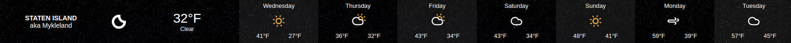
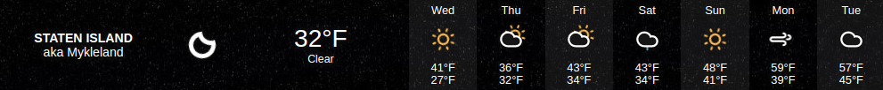
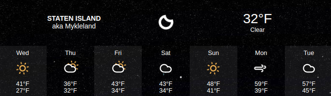
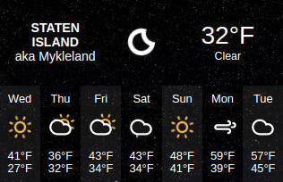
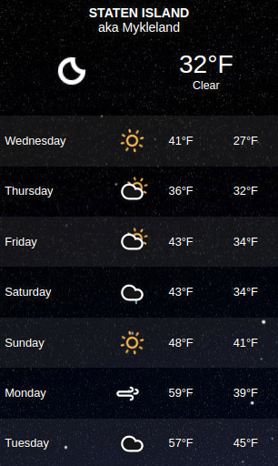
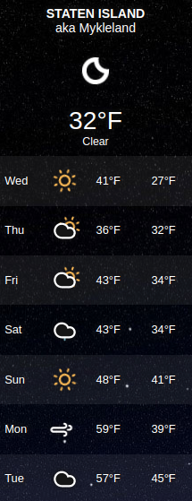
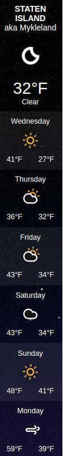
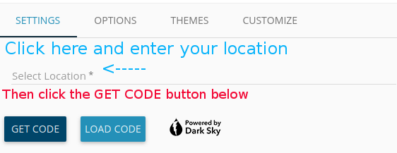
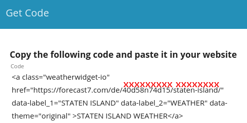

## MMM-WeatherOrNot

* Driven by the Darksky API yet you don't need an API key!

## Responsive

* This module will respond to the size of its container.
* It will fit nicely in any region. Squeeze it or stretch it.
* It will reformat itself as you change the width and height.

## Customizable

* You can customize nearly everything.
* Fonts, colors, icons, icon colors, languages.
* Many themes are included.
* 27 languages supported.

## Examples
### Simply by changing the height and width, the module reformats itself.














## Installation

* `git clone https://github.com/mykle1/MMM-WeatherOrNot` into the `~/MagicMirror/modules` directory.

* Get your location and locationCode for config entry. See Instructions below.

## Config.js entry and options

```
{
    disabled: false,
    module: 'MMM-WeatherOrNot',
    position: 'middle center',
    config: {
      location: "staten-island",                // See instructions
      locationCode: "40d58n74d15",              // See instructions
      languages: "en",                          // See Languages list
      tempUnits: "F",                           // F or C
      font: "Tahoma",                           // See Font list
      textColor: "#ffffff",                     // Hex color codes.
      htColor: "#ffffff",                       // high temp color. Hex color codes.
      ltColor: "#00dfff",                       // low temp color. Hex color codes.
      sunColor: "#febc2f",                      // Hex color codes.
      moonColor: "#dfdede",                     // Hex color codes.
      cloudColor: "#dfdede",                    // Hex color codes.
      cloudFill: "#1f567c",                     // Hex color codes.
      rainColor: "#93bffe",                     // Hex color codes.
      snowColor: "#dfdede",                     // Hex color codes.
      height: "200px",                          // module is responsive to changes
      width: "1200px",                          // module is responsive to changes
      label: "New Dorp",                        // Location seems logical . .
      label2: "Staten Island",                  // . . . or anything you like
      days: "7",                                // 3, 5 or 7
      theme: "dark",                            // See Themes list *** theme overrides bgColor. ***
      bgColor: "#000000",                       // theme overrides bgColor.
      icons: "Climacons Animated",              // Iconvault, Climacons or Climacons Animated
      animationSpeed: 3000,
      updateInterval: 10 * 60 * 1000,
    }
},
```
## Instructions for location and locationCode for config.

* Go to https://weatherwidget.io/

#### Follow these directions


#### And follow these directions, too.

#### The locationCode and location you need are under the red xxxxxxxxxx's. Enter those in config


## Font List

* Arial
* Arial Narrow
* Arial Black
* Arial Rounded MT Bold
* Arimo
* Consolas
* Courier New
* Fira Sans
* Geeorgia
* Helvetica
* Jura
* Monaco
* Noto Sans
* Noto Serif
* Open Sans
* Open Sans Condensed
* Palatino
* Play
* Roboto
* Roboto Slab
* Tahoma
* Times New Roman
* Tinos
* Trebuchet MS
* Ubuntu
* Verdana

## Languages List - 27 Supported

* Arabic
* Bulgarian
* Czech
* Danish
* German
* Greek
* English
* Spanish
* French
* Croatian
* Hebrew
* Hungarian
* Italian
* Japanese
* Norwegian
* Dutuch
* Polish
* Portuguese
* Romanian
* Russian
* Slovak
* Serbian
* Swedish
* Turkish
* Ukrainian
* Simplified Chinese
* Traditional Chinese

## Themes Flat

* Original
* Pure
* Orange
* Gray
* Dark
* Desert
* Candy
* Beige
* Blank
* Salmon

## Themes Gradient
* Sky
* Metallic
* Ruby
* Kiwi
* Kitty

## Themes Pattern
* Tile Wood
* Pool Table
* Random Grey

## Themes Pattern
* Retro Sky
* Marine
* Mountains
* Blue Mountains
* Grass
* Fall Leaves

## Themes Weather Conditions
* Weather One

## My unending gratitude to sdetweil and cowboysdude

* Thank you, my friends!
